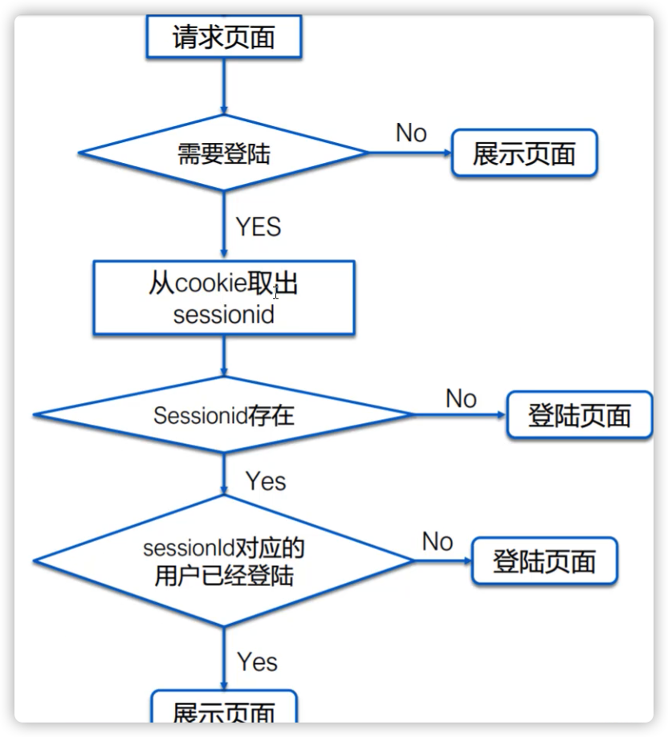
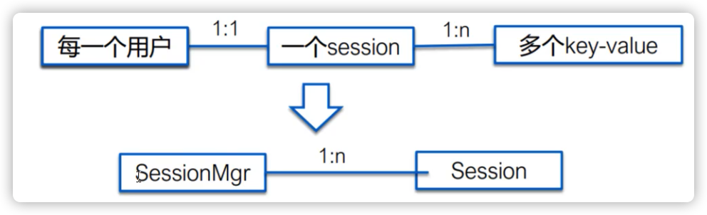
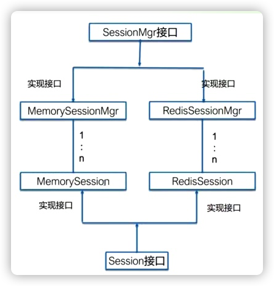
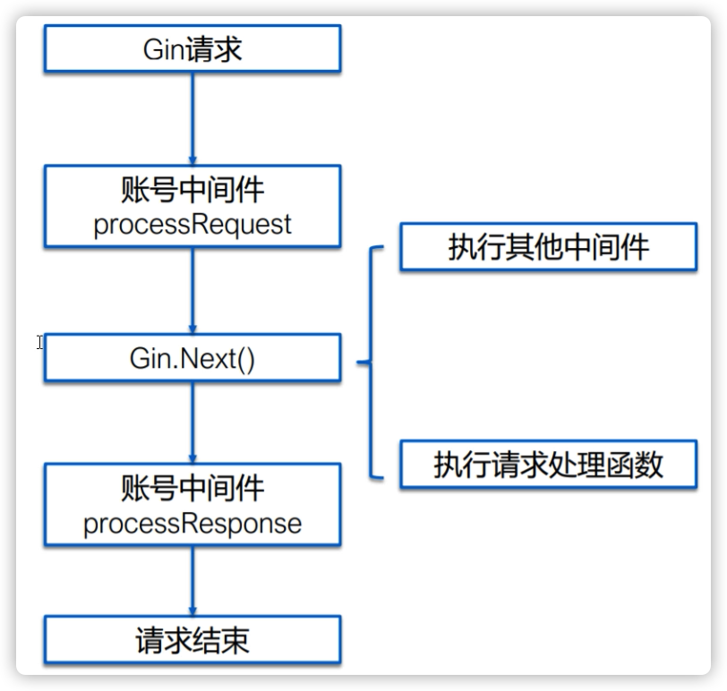

# 项目目标
- 解决用户平时工作、生活中遇到的问题
- 分享知识、经验以及社交互动
- 浏览问题打发时间
# 项目角色
## 回答者
分享知识、经验、获得成就
## 浏览者
学习知识、打发时间
## 提问者
通过提问、获得知识、经验
# 产品核心功能
## 提问
- 发布问题
- 我的问题
## 回答
- 优质答案筛选&排序
    - 点赞
    - 评论
- 答案发布功能
## 浏览
- 问题列表
- 收藏
- 热门列表
- 搜索功能
- 人与人之间的联系
    - 关注功能
- 消息
    - 关注的问题有新回答
    - 提问的问题有新回答
# 产品形态
## Web端
# 技术选型
## 前端
- 使用vue进行页面渲染
## 后端
- 使用Go作为开发语言
## 存储层
- 使用mysql
## 缓存
- 使用redis，提升网站访问性能
## 消息队列
使用nsq作为消息队列，用来处理异步消息
# 整体架构图

# 基础库选型
## API层
- gin框架
## 日志库
- go系统日志
## 配置库
- go开发
# 模块划分
## 短url模块
- 长短url互换
## 账号模块
- 注册功能
- 登录功能
- 个人信息功能
### 实现
#### 规划
- http协议是无状态的，服务端需要确认每次访问者的身份
- 通过用户提供的一些资料，来表明用户的身份
    - 用户资料
        - 手机号&验证码
        - 邮箱&密码
        - 用户名&密码
- 身份验证
    - 方案一 每次请求的时候都把表明身份的用户资料带上 
        - 信息不够安全
        - 用户体验差
    - 方案二 账号系统
        - 进行统一管理和鉴权
        - 通过账号注册吧用户的身份存储起来
        - 登录是鉴权通过，以后不再需要登录 
        - cookie和session共同使用
        - Cookie机制
            - 存储在客户端本地的一个文件数据
            - 浏览器发送请求的时候，自动把cookie给带上
            - 服务端可以设置cookie
            - cookie是针对单个域名的，不同域名之间的cookie是独立的
        - Cookie与登录鉴权
            - 用户登录鉴权账号和密码后，设置一个cookie： username=chenmc
            - 用户每次请求时，会自动吧cookie：username=chenmc，发送到服务端
            - 服务端收到这个请求之后，从cookie里面取出username，然后查询该用户是否登录
            - 如果登录，通过鉴权，否则重定向到注册或者登录界面
        - 方案缺陷
            - Cookie容易被伪造
        - 方案改进
            - 32位随机值uuid替代id
            - 服务端Session
#### 登录流程

#### session模块设计
- 本质上是提供一个key-value系统，通过key进行查询、添加、删除和更新
- Session数据可以存储在内存当中，redis或者数据库中；存储在数据库中可以在多个服务器上共享

- session接口设计
    > Set
    > Get
    > Del
    > Save
- SessionMgr接口设计
    > CreateSession
    > GetSession 通过sessionid获取session
- Redis Session模块设计
    - CreateSession
    - GetSession
    - init

#### 账号中间件开发
- 通过cookie获取sessionId，并查询session获取对应的user_id
- 用户登录之后，需要透明的种上cookie
- 提供获取user_id以及是否登录的接口
##### 为什么需要中间件
- 处理用户session相关功能是通用的，`每个业务都需要`
- 使用gin中间件，能够非常方便的集成session模块
- 并且对于业务是透明的，使用起来非常简单
##### cookie
- golang中，cookie结构
    ```golang
    type Cookie struct {
        // k v
        Name string 
        Value string

        Path string // optional 在哪个路径下生效
        Domain string // optional 在哪个域名下生效
        Expire time.time // 绝对过期时间
        RawExpires string
        MaxAge int // 相对过期时间
        Secure bool // 是否只在https下设置成功
        HttpOnly bool // 只用于http，js等脚本不能读取
        Raw string
        Unparse []string
    }
    ```
- golang中读取cookie
    - 读取单个cookie
        > `http.Request.Cookie(key string)`
    - 读取所有cookies
        > `http.Request.Cookies()`
- 设置cookie
    - `cookie := http.Cookie{Name:"username", Value: "chenmc", MaxAge:3000}`
    - `http.SetCookie(w, &cookie) // w is http.ResponseWriter` 
#### 账号中间件开发
- 具体请求处理前，通过cookie获取sessionid，加载session
- 处理请求之后，如果session有修改，则设置cookie
- 暴露获取user_id和判断登录状态的两个接口

#### 账号模块功能
- 主要提供登录和注册两个功能
- 登录支持账号和密码登录
- 注册只手机用户名、昵称、性别以及密码等信息
- user_id通过全局唯一id生成器生成
    - 若考虑分机分库，不能依靠mysql主键id自增来生成
    - 分布式系统多个分片插入数据时，需要保证插入的id唯一
    - 全局唯一id生成器要求
        - 生成的ID全局唯一
        - 生成的ID最好不大于64bit
            - 不用128位的uuid是因为1，太长；2，是字符串，比较排序有性能影响
        - 高性能要求
        - 整个系统没有单点
    - snowflake算法
        - 41为时间戳 | 10位节点id | 12位序列号
    - github: github.com/snoy/snoyflake
##### 账号数据库设计
```sql
CREATE TABLE `user` (
    `id` bigint(20) NOT NULL AUTO_INCREMENT,
    `user_id` bigint(20) NOT NULL,
    `username` varchar(64) COLLATE utf8mb4_general_ci NOT NULL,
    `nickname` varchar(64) COLLATE utf8mb4_general_ci NOT NULL DEFAULT '',
    `password` varchar(64) COLLATE utf8mb4_general_ci NOT NULL,
    `email` varchar(64) COLLATE utf8mb4_general_ci NOT NULL,
    `sex` tinyint(4) NOT NULL DEFAULT '0',
    `create_time` timestamp NULL DEFAULT CURRENT_TIMESTAMP,
    `update_time` timestamp NULL DEFAULT CURRENT_TIMESTAMP ON UPDATE CURRENT_TIMESTAMP,
    PRIMARY KEY  (`user_id`),
    UNIQUE KEY `idx_username` (`username`) USING BTREE,
    UNIQUE KEY `idx_user_id` (`user_id`) USING BTREE,
    UNIQUE KEY `idx_id` (`id`) USING BTREE
) ENGINE=InnoDB DEFAULT CHARSET=utf8mb4 COLLATE=utf8mb4_general_ci;
```
##### 前端
- 采用vue.js框架进行开发
- 前端项目的地址，`https://github.com/isanxia/mercury-client`
## 收藏模块
- 收藏列表
- 添加收藏
- 删除收藏
## 问答模块
- 问题提交
    - 问题提交模块整体流程
    
    - 表结构设计
    ```mysql
    CREATE TABLE `question` (
      `id` bigint(20) NOT NULL AUTO_INCREMENT,
      `question_id` bigint(20) NOT NULL,
      `caption` varchar(128) COLLATE utf8mb4_general_ci NOT NULL COMMENT '问题标题',
      `content` varchar(8192) COLLATE utf8mb4_general_ci NOT NULL COMMENT '问题内容',
      `author_id` bigint(20) NOT NULL ,
      `category_id` bigint(20) NOT NULL COMMENT '所属栏目',
      `status` tinyint(4) NOT NULL DEFAULT '1' COMMENT '问题状态',
      `create_time` timestamp NULL DEFAULT CURRENT_TIMESTAMP,
      `update_time` timestamp NULL DEFAULT CURRENT_TIMESTAMP on update current_timestamp,
      primary key (`id`),
      KEY `idx_author_id` (`author_id`),
      KEY `idx_question_id` (`question_id`),
      KEY `idx_category_id` (`category_id`)
    ) ENGINE=InnoDB DEFAULT  CHARSET=utf8mb4 COLLATE=utf8mb4_general_ci;
    ```
        - 该表结构设计存在一些问题，category_id不应该存放在该表中，问题和分类是1:n的关系，
        - 因此要新建一张表，存放categor_id - question_id，组成n:m的表结构
        - 或每个category_id下有哪些问题，推荐使用redis数据库，可进行交集，并集等集合操作
        - 或者把category_id视为一个专栏，形成一个1:1的关系
    - 敏感词过滤功能开发
        - 1.采用正则表达式进行过滤
            - 性能差 单词替换 O(n*m)
        - 2.采用trie树进行过滤和替换
            - 字典树，前缀相同的在同一子树，节省空间
            - 查找速度快 整体性能 O(n*m)
    - 提交模块开发
- 问题列表
    - 表结构设计
      ```mysql
      create table `category` (
        `id` int(11) NOT NULL AUTO_INCREMENT,
        `category_id` int(10) unsigned NOT NULL ,
        `category_name` varchar(128) COLLATE utf8mb4_general_ci NOT NULL,
        `create_time` timestamp NULL DEFAULT CURRENT_TIMESTAMP,
        `update_time` timestamp NULL DEFAULT CURRENT_TIMESTAMP on update current_timestamp,
        PRIMARY KEY (`id`),
        UNIQUE KEY `idx_category_id` (`category_id`),
        UNIQUE KEY `idx_category_name` (`category_name`)
      )ENGINE=InnoDB DEFAULT  CHARSET=utf8mb4 COLLATE=utf8mb4_general_ci;
      ```
- 问题原数据维护
    - 问题作者、回答数
#### 敏感词过滤模块开发
- 1.Trie树构造
- 2.词库加载
- 3.敏感词过滤和替换

## 关注模块
- 关注的人
- 关注的问题
## 通知模块
- 关注的问题有新回复
- 提问的问题有新回复
## 点赞模块
## 评论模块
- 评论列表
- 评论发布
## 搜索模块
- 全文搜索
- 问题搜索
## 个人开发中遇到的问题
### vue前端代码用npm i 安装依赖出现问题
- 解决办法
    - 下载最新的node.js
    - 换淘宝源
    - 用淘宝源安装cnpm
    - sudo cnpm i 
### 调试注册代码，出现跨域访问问题，访问被浏览器阻止
- 问题原因
    - vue前端代码中basepath是`http://localhost:9090`，而调试用的url是`127.0.01:9090`
- 解决办法
    - 区分localhost与127.0.0.1的区别，用localhost组成uri访问
### 数据库user表少了password column
- 解决办法增加一列`alter table user add column password varchar(64) COLLATE utf8mb4_general_ci NOT NULL after nickname;`
### 调试时，端口9090被占用，运行不了qasystem
- 解决办法
    - `lsof -i:9090`查看哪个进程在使用端口号，及其pid
    - kill 对应的pid
### 用户首次登录时cookie设置失败
- 首次登录时，sesion不存在，需要重新创建，创建后需要设置sessionId，而我中间多了一个判断session.IsModify的操作，然后首次创建的session显然是没有修改的，导致错过设置，影响到保存了
- 解决办法，首次登录直接设置新的sessionId，并保存
### cookie数据提交给浏览器失败
- 原因：在LoginHandle中，在ctx.JSON之后再SetCookie，根据gin框架的规则，应该先SetCookie，再ctx.JSON
```
mdlacc.ProcessRequest(ctx)

	defer func() {
		if err != nil {
			return
		}

		// 由于gin框架的特性，需要在util.ResponseSuccess之前调用，不能放在defer中
		fmt.Println("ProcessResponse")
		mdlacc.ProcessResponse(ctx)
		// 登录成功，那么我们设置user_id到用户session中
		util.ResponseSuccess(ctx, nil)
	}()
```
